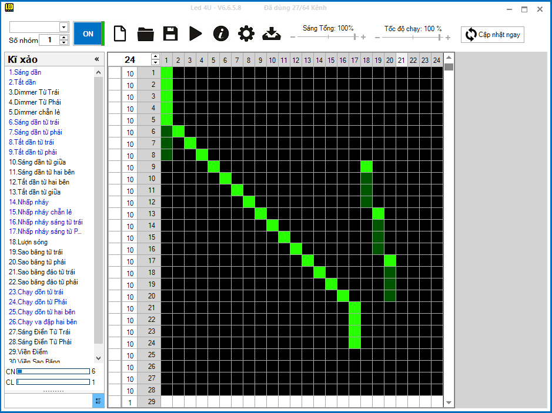

# Path from Earth to Mars

The objectif is to make a big version of the animated photo below onto a wall:

...

## Pre-requisite

**Material**

* 5 red, 5 blue and 15 white LED bulbs with integrated resistor (LED liền trở);
* A 24-channel LED control module. I use [this board](http://led4u.vn/product/mach-dieu-khien-led-vay-don-sac-24-cong-cong-suat-6a/) from LED4U (using a STM8S chip);
* A [USB loader](http://led4u.vn/product/usb-nap-led4u/) made for LED4U;
* Arduino Nano or similar;
* A relay (of type pull-to-low-to-trigeer);
* A pushbutton;
* An adapted power source (my 9V-1A is ok for now).

**Specialized software**

* Download and install `Led4u_V6658.exe` (included in this repository).

## Configuration

**Assemble the delay circuit**

The LED4U board loops forever, whilst the animation should only start when the player pushes the button (he/she can release right away) and stop when the animation is completed. The following circuit will do that job:

```
Pushbutton
NC  NO  C
|   |   |
3   4   5
 Arduino
    2
    |
    in
  Relay
NC  NO  C
|   |   |
    V+  V+_LED4U
```

**Assign LEDs to channels**

```
Blue : 01          18          19          20          17
White:    02 03 04 05 06 07 08 09 10 11 12 13 14 15 16
Red  : 01          18          19          20          17
```

**Load software into boards**

* Load the Arduino sketch;
* Load the `.l4u` file (included in this repository) into the LED4U module (screenshot below).



At the end, here's how things turn out: (with mockup LEDs only):

[](https://youtu.be/i9UpN63B83E)
